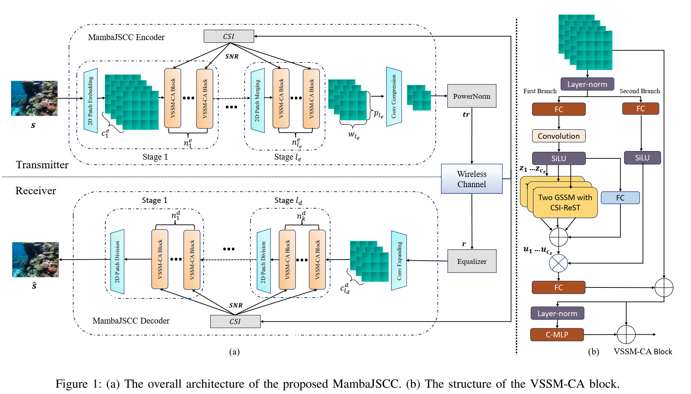
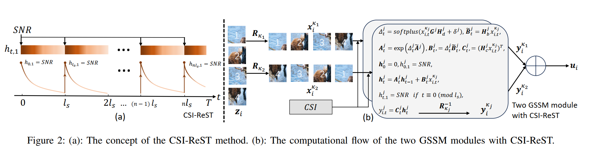

<div align="center">
<h1>MambaJSCC </h1>
<h3>MambaJSCC: Adaptive Deep Joint Source-Channel Coding with Generalized State Space Model</h3>


Tong Wu<sup>1</sup>, Zhiyong Chen<sup>1</sup>, Meixia Tao<sup>1</sup>, Fellow, IEEE, Yaping Sun<sup>3</sup>, Xiaodong Xu<sup>2,3</sup>,
Wenjun Zhang<sup>1</sup>, Fellow, IEEE, and Ping Zhang<sup>2,3</sup>, Fellow, IEEE  

1. Cooperative Medianet Innovation Center (CMIC),Shanghai Jiao Tong University, Shanghai Key Laboratory of Digital Media Processing and Transmission

2.   Laboratory of Networking and Switching Technology, Beijing University of Posts and Telecommunications 

3.	 Department of Broadband Communication, Peng Cheng Laboratory  


Paper : https://arxiv.org/abs/2409.16592

</div>

# Overview

This is the official deployment of the paper "MambaJSCC: Adaptive Deep Joint Source-Channel Coding with Generalized State Space Model"

<p align="center">
  
</p>

<p align="center">
  
</p>

# Installation

- Install the requirements

  ```
  pip install -r requirements.txt
  ```
  
- Install the **adaptive_selective_scan CUDA core** for the channel adaptation: 'ssm', standing for the CSI-ReST method

   ```
   cd ./adaptive_selective_scan
   rm -r dist/ build/; pip install .
   pytest test_selective_scan.py # expected all pass
   ```

   

- [Option] Install the **selective_scan CUDA core** for the channel adaptation: 'attn' and 'no'. The CUDA core is prepared for ablation.

   ```
   cd ./selective_scan
   rm -r dist/ build/; pip install .
   pytest test_selective_scan.py # expected all pass
   ```
   
- Other requirements:
  
  - Linux
  - NVIDIA GPU
  - Pytorch 1.12+
  - CUDA 11.6+

# Quick start

The [main.py](./main.py) file contain the main experiments of our paper. 

**Before running**, you are required to do:
	
- change the `config_path` in the [main.py]() file according to your environment.

- change the paths of checkpoints and datasets according to your environment in the [vssm_tiny_DIV2K.yaml](./configs/train/vssm_tiny_DIV2K.yaml) and [vssm_tiny_DIV2K.yaml](./configs/vssm/vssm_tiny_DIV2K.yaml).

**Now,** simply `run` the file [main.py](./main.py) and you can train your own model and evaluate the performance in PSNR.

We fixed the random seed and try to ensure the ensure you to get the same performance. 


# Further Usage

We provide the main experimental setup in the `configs`, including:

- PSNR, MS-SSIM, LPIPS
- AWGN and Rayleigh fading channel
- CSI-ReST, Channel ModNet, no-CSI
- Two GSSM and four GSSM as they in VMamba
- CelebA, DIV2K, AFHQ for training in resolution of 128, 256 and 512
- Kodak, CLIC2021, CIFAR10 for evaluation in resolution of 128

How to use the support mode is described in : 
[vssm_tiny_DIV2K.yaml](./configs/train/vssm_tiny_DIV2K.yaml) and [vssm_tiny_DIV2K.yaml](./configs/vssm/vssm_tiny_DIV2K.yaml)


# PreTrained Models

We provide some checkpoints of our model and you can download them [here](https://drive.google.com/drive/folders/1nrX6FiULN04PomW2eVaWwNDmM3Hhka0Y?usp=sharing). 

Including MambaJSCC trained with DIV2K under Rayleigh fading channel, CSI-ReST as channel adaptation method.

Train for:
- PSNR
- MS-SSIM
- LPIPS


# Citation

```
@misc{wu2024mambajsccadaptivedeepjoint,
      title={MambaJSCC: Adaptive Deep Joint Source-Channel Coding with Generalized State Space Model}, 
      author={Tong Wu and Zhiyong Chen and Meixia Tao and Yaping Sun and Xiaodong Xu and Wenjun Zhang and Ping Zhang},
      year={2024},
      eprint={2409.16592},
      archivePrefix={arXiv},
      url={https://arxiv.org/abs/2409.16592}, 
}

```
